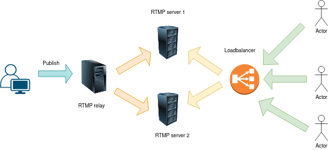

# RTMP K8s

This is a horizonally scalable RTMP deployment. The way this works is we start streaming with any source, and the relay server relays the stream to multiple backends which end-users can use to view the stream.

# How To:
  - To deploy relay server go to relay directory and apply the yamls
    ```
    kubectl apply -f rtmp-relay-deployment.yaml && kubectl apply -f rtmp-relay-service.yaml 
    ```
  - To deploy backend server go to backend directory and apply the yamls
    ```
    kubectl apply -f rtmp-backend-deployment.yaml && kubectl apply -f rtmp-backend-service.yaml 
    ```

# To Do:
  - Add ability to store the stream in server

# Architecture:

